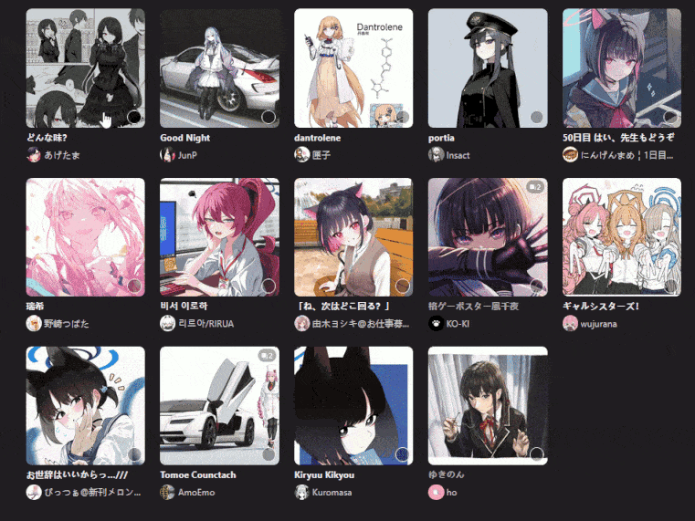

## userscript-pixiv-shift-select
Userscript for shift-key multiselection in Pixiv's bookmarks page. Useful for mass deleting/privating/tagging multiple bookmarks.

> [!WARNING]
># **This was written by AI and I'm an absolute beginner at coding, so use at your own risk.**
# [install](https://github.com/eatlebugs2/userscript-pixiv-shift-select/raw/refs/heads/main/userscript-pixiv-shift-select.user.js)
Selecting a bookmark item, then holding Shift while selecting another bookmark item will automatically select everything between those two bookmarks.

Shift+Click to select.
Shift+Ctrl+Click to deselect.
## Known bugs
- No support for selecting a range spanning multiple pages w/ a single click, you have to go through the pages manually.
- It will sometimes glitch and randomly select text, very annoying. 
